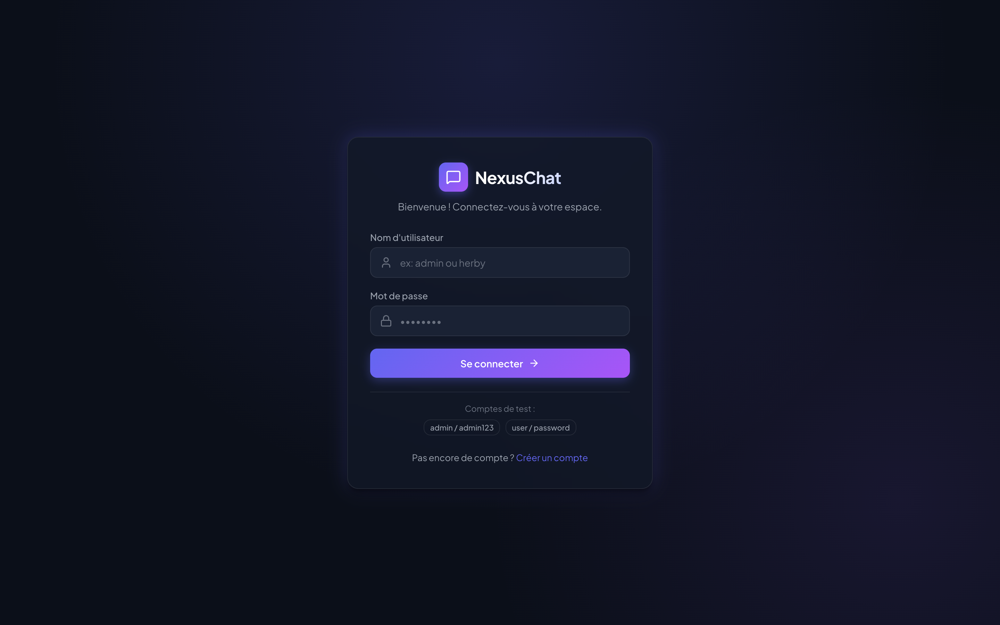
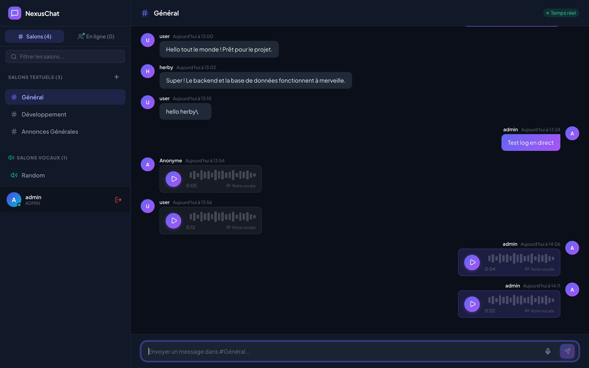
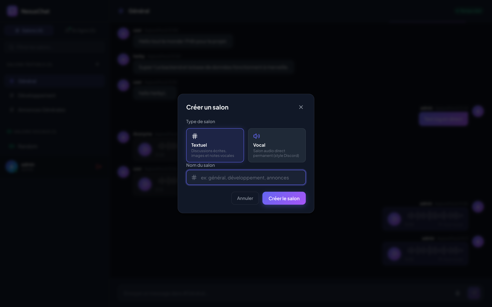
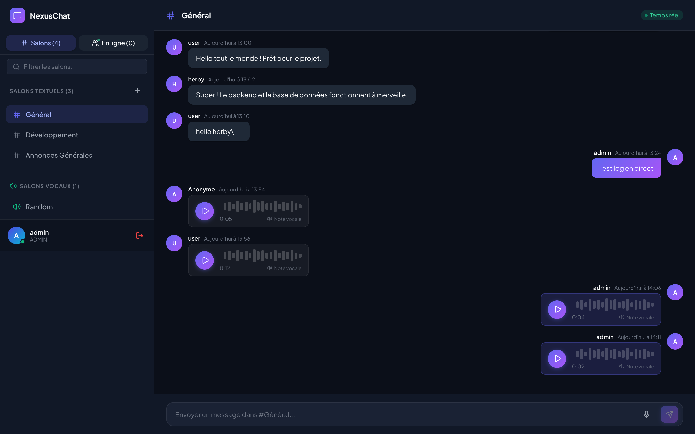
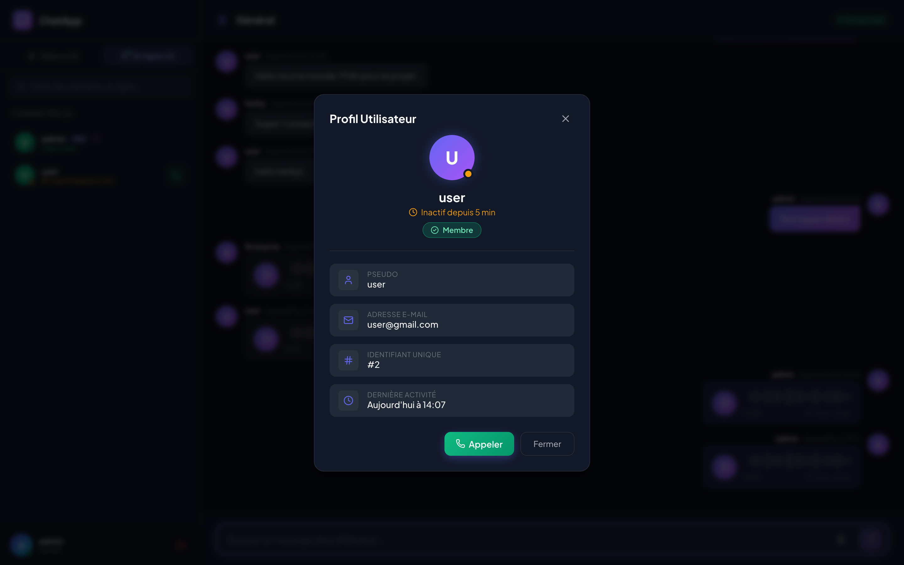
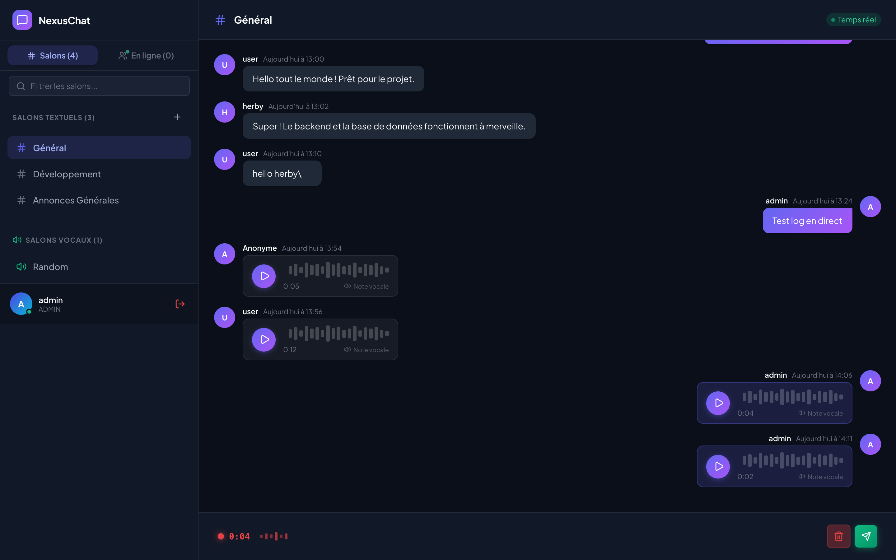
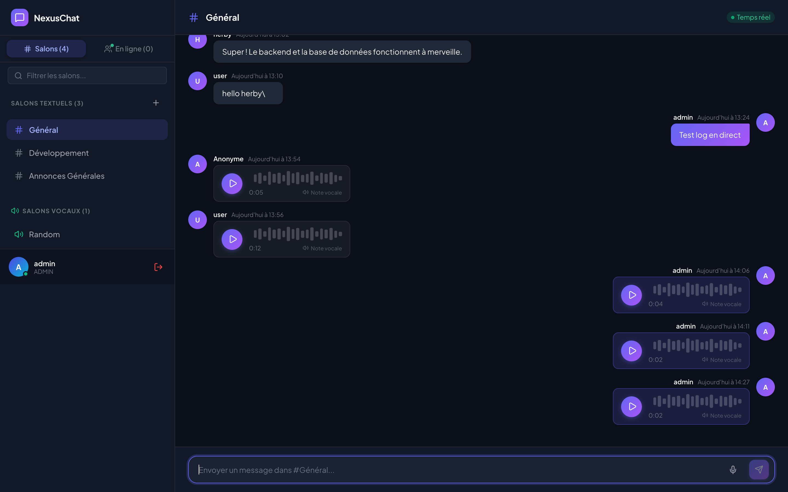
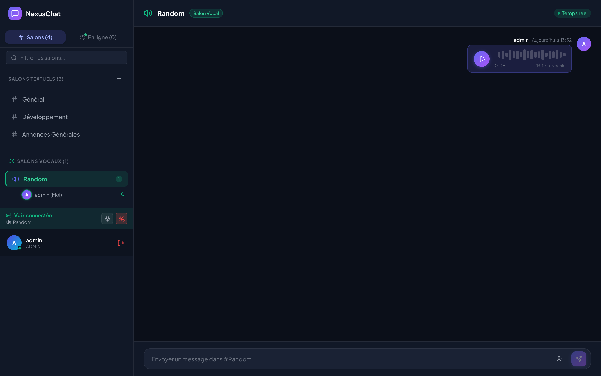
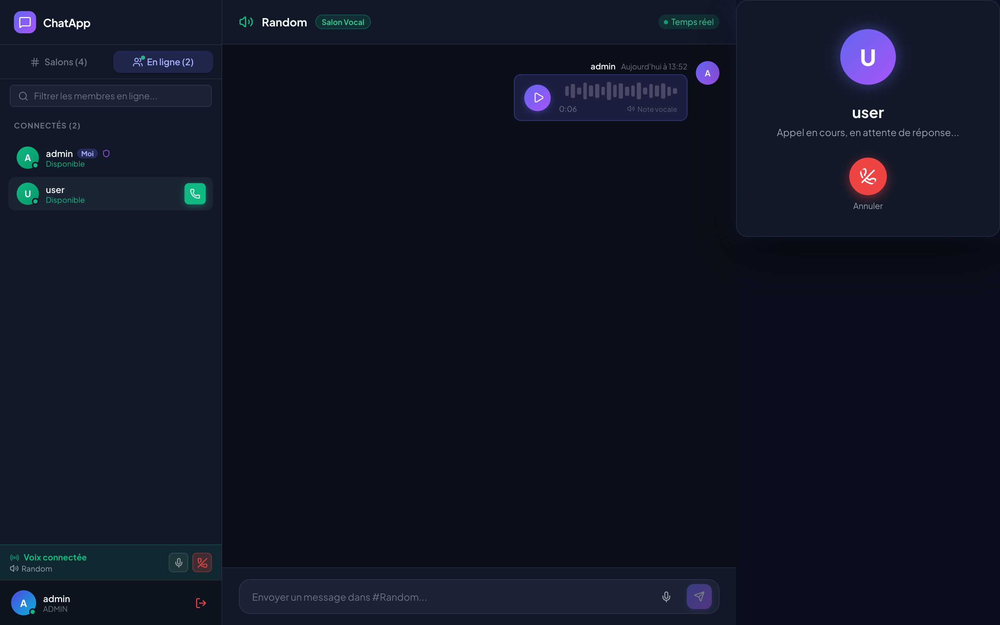
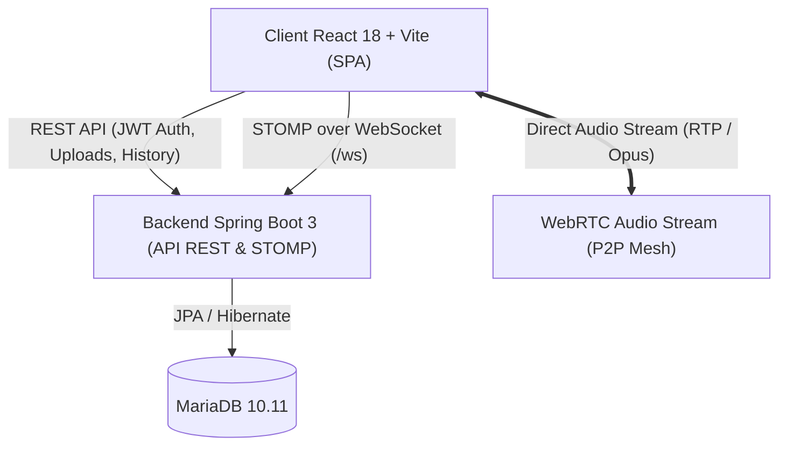

# 💬 NexusChat — Plateforme de Communication Temps Réel & Vocale

[](https://spring.io/projects/spring-boot)
[](https://reactjs.org/)
[](https://vitejs.dev/)
[](https://webrtc.org/)
[](https://stomp.github.io/)
[](https://www.docker.com/)
[](https://mariadb.org/)

**NexusChat** est une application web moderne de messagerie collaborative combinant la fluidité d'une messagerie instantanée, la flexibilité des salons vocaux style **Discord**, la puissance des appels directs pair-à-pair **WebRTC**, et la gestion de présence / statuts d'activité inspirée de **Microsoft Teams**.

---

## 📸 Galerie des Fonctionnalités

### 1. Authentification Sécurisée & Comptes de Test
Interface d'authentification avec design sombre, effet de verre (*glassmorphism*), gestion des jetons JWT sécurisés et raccourcis pour comptes de test.



---

### 2. Tableau de Bord Principal & Salons
Vue d'ensemble complète : barre latérale avec salons textuels (`#`) et salons vocaux (`🔊`), suivi des utilisateurs en direct, et espace de discussion réactif avec bulles modernes.



---

### 3. Création de Salons (Textuels & Vocaux)
Modale dédiée permettant de créer à la volée des salons textuels classiques ou des salons vocaux permanents.



---

### 4. Présence & Statuts d'Activité (Style Microsoft Teams)
Suivi en direct des utilisateurs connectés avec indicateur coloré et temps d'inactivité dynamique (*« Actif il y a X min »* ou *« Inactif depuis X min »*), ainsi que bouton d'appel direct.



---

### 5. Profil Utilisateur Détaillé
Fiche profil affichant les rôles (Admin / Membre), identifiant unique, adresse e-mail, historique de dernière connexion et bouton d'action rapide pour lancer un appel.



---

### 6. Enregistrement de Notes Vocales
Enregistreur audio intégré avec chronomètre en direct, barre d'ondes sonores animées, bouton d'annulation et d'envoi instantané vers le salon actif.



---

### 7. Lecteur Audio avec Onde Sonore
Lecteur interactif au sein des messages avec visualisation de forme d'onde, suivi du temps de lecture, vitesse 1.0x calibrée et support du streaming partiel (*HTTP Range 206*).



---

### 8. Salons Vocaux Permanents (Style Discord)
Connexion audio multi-utilisateurs dans des canaux dédiés. Affichage en temps réel des participants connectés avec halo vert lorsqu'ils parlent, et barre de statut vocale persistante en bas de l'écran avec contrôle mute et déconnexion.



---

### 9. Appels Directs 1-à-1 (WebRTC Peer-to-Peer)
Appels vocaux directs entre deux utilisateurs sans serveur média intermédiaire : sonnerie interactive générée par la Web Audio API, animation sonar d'attente, bouton accepter / refuser, et bandeau d'appel actif avec chronomètre.



---

## 🛠 Architecture & Technologies



### Stack Technique

| Domaine | Technologies |
| :--- | :--- |
| **Frontend** | React 18, Vite 5, Lucide Icons, SockJS Client, STOMPjs, Web Audio API, WebRTC Native API |
| **Backend** | Java 17, Spring Boot 3.1.5, Spring Security 6, Spring WebSocket / Messaging, JJWT |
| **Base de données** | MariaDB 10.11, Spring Data JPA, Hibernate ORM |
| **Audio & Media** | MediaRecorder (Opus / WebM / MP4), Spring Audio Streaming (HTTP 206 Partial Content) |
| **Conteneurs** | Docker, Docker Compose |

---

## 🚀 Démarrage Rapide

### 1. Prérequis
- [Docker](https://www.docker.com/) & Docker Compose
- [Node.js](https://nodejs.org/) v18+ & `npm`
- [Java 17](https://www.oracle.com/java/technologies/javase/jdk17-archive-downloads.html) & Maven (optionnel si exécuté via Docker)

### 2. Démarrer l'infrastructure et le Backend (Docker)

À la racine du projet :

```bash
docker-compose up -d --build
```

Les services suivants seront alors disponibles :
- **Backend API & WebSocket** : `http://localhost:8080`
- **Base de données MariaDB** : `localhost:3306`
- **Interface phpMyAdmin** : `http://localhost:8181`

### 3. Démarrer le Frontend (React / Vite)

Dans un nouveau terminal :

```bash
cd client
npm install
npm run dev
```

L'application s'ouvre sur **`http://localhost:5173`**.

---

## 🔑 Comptes de Test Pré-configurés

| Nom d'utilisateur | Mot de passe | Rôle |
| :--- | :--- | :--- |
| **admin** | `admin123` | Administrateur (`ROLE_ADMIN`) |
| **user** | `password` | Utilisateur standard (`ROLE_USER`) |

---

## 📡 Points de Terminaison & Protocoles

### Endpoints REST Clés

- `POST /api/auth/signin` : Authentification et obtention du token JWT.
- `POST /api/auth/signup` : Inscription d'un nouvel utilisateur.
- `GET /api/chats` : Récupération de tous les salons (textuels et vocaux).
- `POST /api/chats` : Création d'un salon (`type: "TEXT" | "VOICE"`).
- `GET /api/messages/{chatId}` : Historique des messages d'un salon.
- `POST /api/messages` : Envoi d'un message textuel.
- `POST /api/messages/audio` : Upload multipart d'une note vocale.
- `GET /uploads/audio/{filename}` : Streaming audio sécurisé avec support du Range HTTP (`206 Partial Content`).
- `GET /api/presence/users` : Liste des utilisateurs actuellement en ligne.
- `GET /api/presence/activities` : Horodatages et statuts d'activité (style Teams).
- `GET /api/chats/voice/rooms` : Résumé des participants connectés dans les salons vocaux.

### Destinations STOMP WebSocket (`/ws`)

- `/app/user/presence` : Notification de battement de cœur / présence utilisateur.
- `/topic/online-users` : Diffusion en temps réel des présences et inactivités.
- `/topic/chat/{chatId}` : Réception instantanée des messages d'un salon.
- `/app/call/signal` ➡️ `/topic/call/{username}` : Signalisation d'appels 1-à-1 WebRTC (offres, réponses, candidats ICE).
- `/app/voice/join` & `/app/voice/leave` : Gestion de présence dans les salons vocaux Discord.
- `/app/voice/signal` ➡️ `/topic/voice/{chatId}/signals` : Routage mesh WebRTC pour salons vocaux.

---

## 🧪 Tests & Qualité

### Tests Unitaires & Intégration Backend
La suite de tests Spring Boot valide l'authentification, les flux REST, l'upload de fichiers audio et la gestion des salons vocaux :

```bash
cd server
./mvnw clean test
```

Résultats : **14 tests exécutés avec 100% de succès**.

### Build Frontend
Pour vérifier la conformité de l'application cliente :

```bash
cd client
npm run build
```

---

## 📂 Structure du Répertoire

```text
NexusChat/
├── client/                     # Application Frontend React 18 + Vite
│   ├── src/
│   │   ├── components/         # Composants UI (Chat, AudioPlayer, CallModal...)
│   │   ├── context/            # Contexte d'authentification JWT
│   │   ├── pages/              # Pages principales (Home, Login, Register)
│   │   └── services/           # Services API REST, WebSocket STOMP & WebRTC
│   └── capture_screenshots.js  # Script automatisé de capture d'écran
├── server/                     # Backend Spring Boot 3
│   ├── src/main/java/com/server/server/
│   │   ├── config/             # Sécurité JWT, WebSocket & Filtres HTTP
│   │   ├── controllers/        # Contrôleurs REST, Audio & STOMP Signaling
│   │   ├── models/             # Entités JPA (User, Chat, Message)
│   │   ├── repository/         # Répertoires Spring Data JPA
│   │   └── security/services/  # Services Métier (Presence, VoiceRooms, Auth)
│   └── pom.xml
├── screenshots/                # Galerie des captures d'écran haute résolution
├── docker-compose.yml          # Déploiement multi-conteneurs
└── README.md                   # Documentation officielle du projet
```
